<div align="center">


**Automate insights, recommendations, and actions across your marketing and sales tools**

[](https://adup.io)
[]()
[]()

</div>

---

## 🎯 What is AdUp?

AdUp is a **next-generation platform** that helps online businesses grow faster by automating insights, recommendations, and actions across their entire marketing and sales ecosystem. We connect to your favorite tools and give you a crystal-clear view of what's working—and exactly what to do next.

### ✨ How It Works

```mermaid
graph LR
    A[📊 Data Sources] --> B[🧠 AI Analytics]
    B --> C[💡 Smart Insights]
    C --> D[🎯 Actionable Recommendations]
    D --> E[📈 Business Growth]
    
    A --> F[Shopify]
    A --> G[HubSpot]
    A --> H[Google Analytics]
    A --> I[Stripe]
```



### 🔧 Our Three-Step Process

1. **📡 Data Unification** - Pull in data from multiple sources (sales, traffic, ads, email, support tools)
2. **🧠 Analysis & Insights** - Use AI to analyze trends, spot issues, and surface key patterns
3. **💡 AI Recommendations** - Get personalized, actionable recommendations to optimize your business

---

## 🤖 Meet TARA - Your AI Business Assistant

### **T**rends **A**nalysis & **R**ecommendation **A**ssistant

*Your intelligent guide to making smarter decisions, faster*

> **"Why did sales drop last week?"** - TARA analyzes your data and gives you the answer in seconds  
> **"Show me which campaigns are working best"** - TARA pulls insights from all your connected tools  
> **"What should I optimize next?"** - TARA proactively suggests high-impact actions  

### 🎪 What TARA Does

| Feature | Description |
|---------|-------------|
| **👁️ Always-On Monitoring** | Watches for changes, trends, and anomalies 24/7 |
| **💬 Conversational Interface** | Chat naturally to get insights and data |
| **🔔 Proactive Nudges** | Suggests actions before you think to ask |
| **📢 Notifications** | Get alerts when important changes or opportunities are detected |

---

## 🔗 Integrations

Connect AdUp with your entire business stack:

### 🛍️ E-commerce & Sales

| Integration | Platform | Description |
|-------------|----------|-------------|
| **Shopify** 🏪 | E-commerce | Complete e-commerce platform |
| **WooCommerce** 🛒 | E-commerce | WordPress e-commerce solution |
| **Stripe** 💳 | Payments | Payment processing platform |

### 📊 Analytics & Marketing

| Integration | Platform | Description |
|-------------|----------|-------------|
| **Google Analytics** 📊 | Analytics | Web analytics and insights |
| **Google Search Console** 🔍 | SEO | Search engine optimization analytics |
| **HubSpot** 🟠 | CRM | Customer relationship management & marketing |

### 📱 Advertising & Social

| Integration | Platform | Description |
|-------------|----------|-------------|
| **Facebook Ads** 📘 | Advertising | Social media advertising platform |
| **TikTok Ads** 🎵 | Advertising | Social media marketing platform |
| **Intercom** 💬 | Support | Customer support and engagement |

> 💡 **More integrations coming soon!** Can't find your tool? [Let us know!](https://adup.featurebase.app/)

---

## 🎯 Perfect For

### 🛒 E-commerce Founders
Stop jumping between dashboards. Get a unified view of what's working.

### 📈 Growth Teams  
Optimize campaigns and track goals with AI-powered insights.

### ⚙️ RevOps Teams
Bird's-eye view across all platforms with automated recommendations.

---

## 🚀 Getting Started

```bash
# Ready to supercharge your business?
1. Visit adup.io & Sign-up for Free
2. Connect your tools
3. Let TARA guide you to your first win
4. Watch your business grow 📈
```

<div align="center">

### 🌟 **Join the Growth Revolution**

[](https://seller.adup.io/register?source=github_readme)
[](https://adup.io/privacy)
[](https://intercom.help/ad-up/en)

</div>

---

<div align="center">

**Built with ❤️ by the AdUp Team**


[](mailto:info@adup.io)
[](hhttps://www.linkedin.com/company/adup-tara)


</div>
